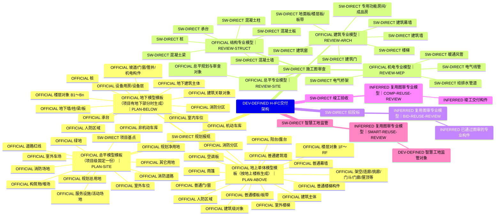

# H-IFC交付架构｜证据分层可编辑思维导图 v0.4

> 规则：每个对象、载体、数据集和属性单独标注证据。OFFICIAL、USER、INFERRED、DEV-DEFINED 均不得写成 BIMeta 软件确认。

## 证据图例

| 标记 | 含义 | 软件确认 | 可直接写死为BIMeta事实 |
|---|---|---:|---:|
| `SW-RUNTIME` | 软件运行确认 | 是 | 是 |
| `SW-DIRECT` | 软件静态直接提取 | 是 | 是 |
| `OFFICIAL` | 湖北官方文件 | 否 | 否 |
| `USER` | 用户输入/使用经验 | 否 | 否 |
| `INFERRED` | 分析推断，待验证 | 否 | 否 |
| `DEV-DEFINED` | 自研定义/开发占位 | 否 | 否 |

## 本版审计结果

- 树节点：1020
- 证据声明：1203
- 包含软件证据的节点：466
- 软件运行确认：0（本次未运行BIMeta）

### 关键纠偏

- AreaSpace、RoadArea、BuildingObject、StoreyObject等不再标为BIMeta已确认载体；规划阶段具体Revit载体统一设为TBD。
- TP*、AG*、UG*、DS00～DS04明确标为DEV-DEFINED逻辑名称。
- 规划对象及其属性主要标为OFFICIAL，不再标为软件确认。
- 车位图标/命令资源只作为相关软件信号记录，不能确认室外/室内、车场/车位分类或具体载体。
- B.*、C.*表号、构件字段、CategoryList入口标为SW-DIRECT。
- IFC实体候选统一标为INFERRED，最终Pset/Property保持未确认。
- 本版SW-RUNTIME为0；未执行BIMeta。

## 软件证据路径（默认视图）

```mermaid
mindmap
  DEV-DEFINED H-IFC交付架构
    SW-DIRECT 规划报规
      OFFICIAL 总平模型模板（项目级固定一份）｜PLAN-SITE
        SW-DIRECT 项目基点
          SW-DIRECT 软件数据对象｜ProjectBase；具体Revit载体待运行确认
            SW-DIRECT 自研逻辑数据集｜TP00_PROJECT_BASE｜项目基点与坐标
      OFFICIAL 地上单体模型模板（按地上楼栋生成）｜PLAN-ABOVE
        OFFICIAL 普通门/窗
          OFFICIAL Revit载体｜待验证（业务上为规划报批功能空间/模型单元）
            SW-DIRECT BIMeta软件表｜B.1｜建筑门窗专用
        OFFICIAL 普通幕墙
          OFFICIAL Revit载体｜待验证（业务上为规划报批功能空间/模型单元）
            SW-DIRECT BIMeta软件表｜B.2｜建筑幕墙专用
        OFFICIAL 普通建筑墙
          OFFICIAL Revit载体｜待验证（业务上为规划报批功能空间/模型单元）
            SW-DIRECT BIMeta软件表｜B.40｜建筑墙专用
        OFFICIAL 普通楼板/板带
          OFFICIAL Revit载体｜待验证（业务上为规划报批功能空间/模型单元）
            SW-DIRECT BIMeta软件表｜B.44｜地面板/楼层板/板带专用
        OFFICIAL 普通楼梯构件
          OFFICIAL Revit载体｜待验证（业务上为规划报批功能空间/模型单元）
            SW-DIRECT BIMeta软件表｜B.45｜楼梯专用
      OFFICIAL 地下模型模板（项目有地下部分时生成）｜PLAN-BELOW
        OFFICIAL 地下墙/柱/梁/板
          OFFICIAL Revit载体｜待验证（业务上为规划报批功能空间/模型单元）
            SW-DIRECT BIMeta软件表｜C.14｜混凝土墙专用
            SW-DIRECT BIMeta软件表｜C.11｜混凝土柱专用
            SW-DIRECT BIMeta软件表｜C.8｜混凝土梁专用
            SW-DIRECT BIMeta软件表｜C.7｜混凝土板专用
        OFFICIAL 桩
          OFFICIAL Revit载体｜待验证（业务上为规划报批功能空间/模型单元）
            SW-DIRECT BIMeta软件表｜C.46｜基础组件桩专用
        OFFICIAL 承台
          OFFICIAL Revit载体｜待验证（业务上为规划报批功能空间/模型单元）
            SW-DIRECT BIMeta软件表｜C.49｜基础组件承台专用
    SW-DIRECT 施工图审查
      OFFICIAL 总平专业模型｜REVIEW-SITE
        OFFICIAL 总平规划与审查对象
          DEV-DEFINED 载体｜AreaSpace / RoadArea / BoundaryLine
            SW-DIRECT 自研逻辑数据集｜TP00_PROJECT_BASE｜项目基点与坐标
      OFFICIAL 建筑专业模型｜REVIEW-ARCH
        SW-DIRECT 建筑门
          SW-DIRECT 载体｜FamilyInstance｜OST_Doors
            SW-DIRECT 自研逻辑数据集｜DS00｜通用标识/编码
            SW-DIRECT 自研逻辑数据集｜DS01-A｜建筑基础设计
            SW-DIRECT BIMeta软件表｜B.1｜建筑门窗专用
        SW-DIRECT 建筑窗
          SW-DIRECT 载体｜FamilyInstance｜OST_Windows
            SW-DIRECT 自研逻辑数据集｜DS00｜通用标识/编码
            SW-DIRECT 自研逻辑数据集｜DS01-A｜建筑基础设计
            SW-DIRECT BIMeta软件表｜B.1｜建筑门窗专用
        SW-DIRECT 建筑幕墙
          SW-DIRECT 载体｜Wall｜OST_Walls（幕墙系统）
            SW-DIRECT 自研逻辑数据集｜DS00｜通用标识/编码
            SW-DIRECT 自研逻辑数据集｜DS01-A｜建筑基础设计
            SW-DIRECT BIMeta软件表｜B.2｜建筑幕墙专用
        SW-DIRECT 建筑墙
          SW-DIRECT 载体｜Wall｜OST_Walls
            SW-DIRECT 自研逻辑数据集｜DS00｜通用标识/编码
            SW-DIRECT 自研逻辑数据集｜DS01-A｜建筑基础设计
            SW-DIRECT BIMeta软件表｜B.40｜建筑墙专用
        SW-DIRECT 地面板/楼层板/板带
          SW-DIRECT 载体｜Floor｜OST_Floors
            SW-DIRECT 自研逻辑数据集｜DS00｜通用标识/编码
            SW-DIRECT 自研逻辑数据集｜DS01-A｜建筑基础设计
            SW-DIRECT BIMeta软件表｜B.44｜地面板/楼层板/板带专用
        SW-DIRECT 楼梯
          SW-DIRECT 载体｜Stairs｜OST_Stairs
            SW-DIRECT 自研逻辑数据集｜DS00｜通用标识/编码
            SW-DIRECT 自研逻辑数据集｜DS01-A｜建筑基础设计
            SW-DIRECT BIMeta软件表｜B.45｜楼梯专用
        SW-DIRECT 专用功能房间/成品房
          INFERRED 载体｜SpatialElement｜Room/Space
            SW-DIRECT 自研逻辑数据集｜DS00｜通用标识/编码
            SW-DIRECT 自研逻辑数据集｜DS01-A｜建筑基础设计
            SW-DIRECT BIMeta软件表｜B.9｜专用功能房间/成品房
      OFFICIAL 结构专业模型｜REVIEW-STRUCT
        SW-DIRECT 混凝土柱
          SW-DIRECT 载体｜FamilyInstance｜OST_StructuralColumns
            SW-DIRECT 自研逻辑数据集｜DS01-S｜结构施工图通用
            SW-DIRECT BIMeta软件表｜C.11｜混凝土柱专用
        SW-DIRECT 混凝土墙
          SW-DIRECT 载体｜Wall｜OST_Walls
            SW-DIRECT 自研逻辑数据集｜DS01-S｜结构施工图通用
            SW-DIRECT BIMeta软件表｜C.14｜混凝土墙专用
        SW-DIRECT 混凝土板
          SW-DIRECT 载体｜Floor｜OST_Floors
            SW-DIRECT 自研逻辑数据集｜DS01-S｜结构施工图通用
            SW-DIRECT BIMeta软件表｜C.7｜混凝土板专用
        SW-DIRECT 混凝土梁
          SW-DIRECT 载体｜FamilyInstance｜OST_StructuralFraming
            SW-DIRECT 自研逻辑数据集｜DS01-S｜结构施工图通用
            SW-DIRECT BIMeta软件表｜C.8｜混凝土梁专用
        SW-DIRECT 桩
          INFERRED 载体｜FamilyInstance｜OST_StructuralFoundation（推定）
            SW-DIRECT 自研逻辑数据集｜DS01-S｜结构施工图通用
            SW-DIRECT BIMeta软件表｜C.46｜基础组件桩专用
        SW-DIRECT 承台
          INFERRED 载体｜FamilyInstance｜OST_StructuralFoundation（推定）
            SW-DIRECT 自研逻辑数据集｜DS01-S｜结构施工图通用
            SW-DIRECT BIMeta软件表｜C.49｜基础组件承台专用
      OFFICIAL 机电专业模型｜REVIEW-MEP
        SW-DIRECT 给排水管道
          SW-DIRECT 载体｜Pipe｜OST_PipeCurves
        SW-DIRECT 暖通风管
          SW-DIRECT 载体｜Duct｜OST_DuctCurves
        SW-DIRECT 电气桥架
          SW-DIRECT 载体｜CableTray｜OST_CableTray
        SW-DIRECT 电气线管
          SW-DIRECT 载体｜Conduit｜OST_Conduit
    SW-DIRECT 招投标
      INFERRED 复用图审专业模型｜BID-REUSE-REVIEW
        INFERRED 已通过图审的专业构件
          DEV-DEFINED 载体｜复用 REVIEW-* 专业模型对象
            SW-DIRECT 自研逻辑数据集｜DS02｜采购数据
    SW-DIRECT 竣工验收
      INFERRED 复用图审专业模型｜COMP-REUSE-REVIEW
        INFERRED 竣工交付构件
          DEV-DEFINED 载体｜复用 REVIEW-* 专业模型对象
            SW-DIRECT 自研逻辑数据集｜DS03｜施工数据
            SW-DIRECT 自研逻辑数据集｜DS04｜维护数据
    SW-DIRECT 智慧工地监管
```



## 完整架构（显示所有证据类型，到对象/载体层）



## 自研名称清单（不能视为软件原名）

```text
PLAN-* / REVIEW-* / BID-* / COMP-* / SMART-*
TP* / AG* / UG* / DS00～DS04 / GEOM_BASIC / MEP_PENDING / WS01_*
AreaSpace / RoadArea / BuildingObject / StoreyObject 等v0.3抽象载体
```

## 开发读取规则

```text
evidenceType = SW-DIRECT 或 SW-RUNTIME → 可作为软件事实使用，但仍需检查claim.scope
evidenceType = OFFICIAL → 只能作为交付要求，不能推断BIMeta实现
evidenceType = USER → 作为使用经验/需求线索
evidenceType = INFERRED → 必须进入验证队列
evidenceType = DEV-DEFINED → 仅供规则引擎、UI和数据库组织
```
